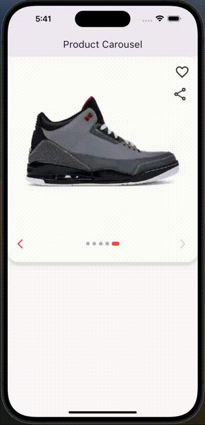
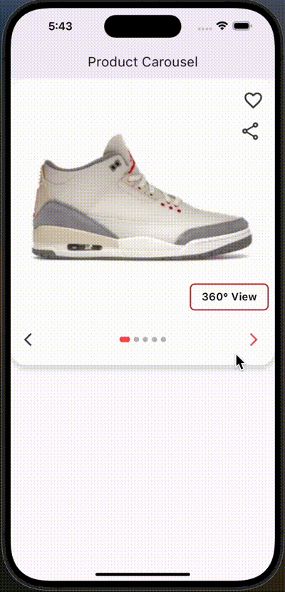

# flutter_product_carousel

flutter_product_carousel is a Flutter package designed to enhance product display in mobile applications by providing an
interactive and visually appealing carousel widget.
It is tailored for showcasing products with features that enhance user experience and engagement.

## Features

- **Customizable Carousel Options**: You can use the default carousel options or customize the carousel options as per
  your requirement.
- **Customizable Navigation Icons**: Allows customization of navigation icons, enabling a seamless integration with the
  app's design theme, By default it will display the 'arrow_back' and 'arrow_forward' icons on Android and '
  arrow_back_ios' and 'arrow_forward_ios' icons on iOS.
- **Autoplay**: Automatically cycles through product images, providing a hands-free browsing experience, You can enable
  or disable the autoplay feature as per your requirement.
- **Infinity Loop**: Supports an infinite loop of product images, allowing users to scroll through products without any
  interruptions.
- **Preview Product Images**: Offers a preview of all product images in a carousel format, allowing users to tap and
  view any image in detail.
- **360-Degree View**: Supports a 360-degree view of products, offering users a comprehensive look from every angle,
  enhancing the decision-making process.
- **Favourite and Share Icons**: Allows users to add products to their favourites and share them with others, enhancing
  user engagement and interaction.

This package is ideal for e-commerce apps and any application where showcasing products in an interactive and engaging
way is crucial.

## Screens

Below are some sample screens of the product carousel in action. 

<p float="left">

&nbsp;&nbsp;&nbsp;&nbsp;&nbsp;

&nbsp;&nbsp;&nbsp;&nbsp;&nbsp;

&nbsp;&nbsp;&nbsp;&nbsp;&nbsp;

</p>

## Getting started

This package is easy to use and can be integrated into your app with minimal effort. To get started, add the package to
your `pubspec.yaml` file and run `flutter pub get`.
and follow the usage section for a quick guide on how to use the package.

## Installation

```yaml
dependencies:
  flutter_product_carousel: <latest_version>
```

## Usage

To use this package, you need to import it into your Dart code and then use the `ProductCarousel` widget to create your
carousel. Below is a simple example of how to use the package to create a basic product carousel.

```dart
import 'package:flutter_product_carousel/flutter_product_carousel.dart';
```

```dart

  ProductCarousel(
    imagesList: const [
        'https://images.stockx.com/images/Air-Jordan-3-Retro-Muslin-Product.jpg?fit=fill&bg=FFFFFF&w=140&h=75&fm=avif&auto=compress&dpr=2&trim=color&updated_at=1648503692&q=60',
        'https://images.stockx.com/images/Air-Jordan-3-Retro-Infrared-23-V2-Product.jpg?fit=fill&bg=FFFFFF&w=140&h=75&fm=avif&auto=compress&dpr=2&trim=color&updated_at=1659538591&q=60',
        'https://images.stockx.com/images/Air-Jordan-3-Retro-Racer-Blue-Product.jpg?fit=fill&bg=FFFFFF&w=140&h=75&fm=avif&auto=compress&dpr=2&trim=color&updated_at=1626802534&q=60',
        'https://images.stockx.com/images/Air-Jordan-3-Retro-Chlorophyll-Product.jpg?fit=fill&bg=FFFFFF&w=140&h=75&fm=avif&auto=compress&dpr=2&trim=color&updated_at=1607663359&q=60',
        'https://images.stockx.com/images/Air-Jordan-3-Retro-Stealth-Product.jpg?fit=fill&bg=FFFFFF&w=140&h=75&fm=avif&auto=compress&dpr=2&trim=color&updated_at=1607662925&q=60'
        ],
    carouselOptions: ProductCarouselOptions(
      autoPlay: true,
      productCarouselController: _productCarouselController,
      showNavigationIcons: true,
      onTap: () {
        setState(() {
           preView = !preView;
        });
        },
      ),
    ),

```

## Additional information

Flutter Product Carousel is a package designed to enhance product display in mobile applications by providing an
interactive and visually appealing carousel widget. It is tailored for showcasing products with features that enhance
user experience and engagement, it is ideal for e-commerce apps and any application where showcasing products in an interactive and engaging way is
crucial, For more information on how to use the package, refer to the [package documentation](https://github.com/noorj-in/flutter_product_carousel), If you have any questions, suggestions, or
feedback, feel free to reach out to the package authors or file an issue [issues](https://github.com/noorj-in/flutter_product_carousel/issues).


